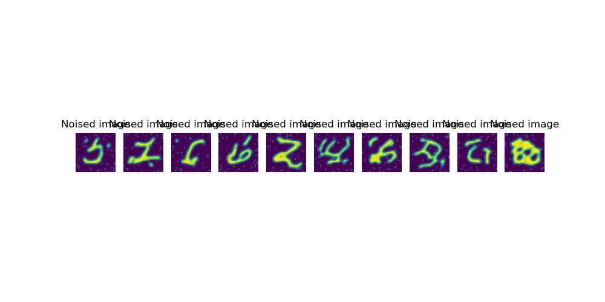
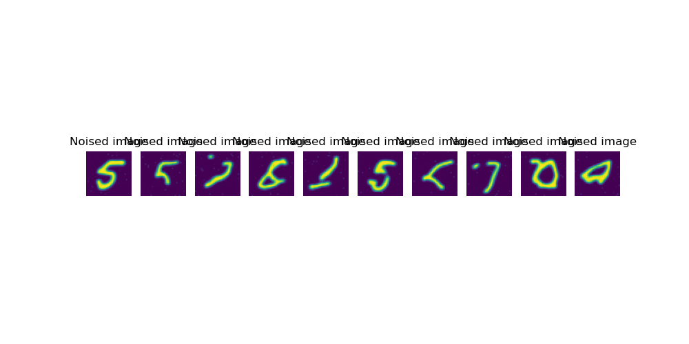

# Diffusion-Based Models

[Original Paper](https://arxiv.org/pdf/2006.11239)

Lots of help from: https://github.com/filipbasara0/simple-diffusion/blob/main/simple_diffusion/model/unet.py
Diffusion-based models operate slightly differently from our VAE model.

The model is no longer attempting to learn how to generate images from a latent space. Instead, the learning process is simplified
by the model learning the random mixing to unmix photos and generate new ones from random samples.

I wasn't able to recreate the reverse diffusion process from purely the original paper. I'm not exactly sure why, but I believe it is something wrong
with my implementation. However, I was able to find some results with the reverse diffusion process of this [paper](https://arxiv.org/pdf/2010.02502).

## How does this work?

### Training
We want to get our model to grow good at learning the gaussian distribution by predicting what the select gaussian term actually is in a sample.

Training occurs as a series of steps as described here:

I wish papers would make explanations less math-dependent (we should expand out of our ecosterism!), but tldr, the model is trying to learn the 
noise that is generated at each timestep. 

I want to point out a key point you're probably wondering, why do we need to sample the timesteps when we are producing noisy images? Remember, we 
want to make sure that our model is not learning dependencies between samples (this is one of the central theories of ML). 
All samples taken should be therefore independent of one another.

### Producing New Images
Then, as we want to produce new image samples, it's as simple as producing a new noisy image that we want to de-noise through a series of timesteps

Using the series of timesteps we specified in the noising process, we continually apply the noise predictor to redefine the original image. Notice the z
term in the image is continaully sampled and added to the denoised image which serves to model the stochasticity of the noising process to make denoising 
non-deterministic.

### Results
I trained my diffusion model for 100 epochs with a 512-timestep cosinusoidal diffusion process. Learning rate was at 1e-4 and reduced learning rate was utilized.

The results here are one of the best selection of 10 generated images together, so please bear that in mind. Note that they are not great and I suspect more training is needed.

Experimenting with the number of steps that noise is added seems to help the inferencing process a lot. Here are some results with a modified inferencing process

This leads me to believe that I did not use enough number of steps in the diffusion process. 512 is probably too little for the model to completely diffuse the model by itself. My guess is a higher amount like 1000 would provide better results.

### Further results

I trained my diffusion model for 100 epochs again this time with 1000 timesteps. The following results were obtained by stopping gaussian noise after 300 inference steps (this makes the image generation significantly less blurry).

    
    
    
    
    

This is the result obtained by stopping gaussian noise after 900 inference steps:

    
    
    
    
    

